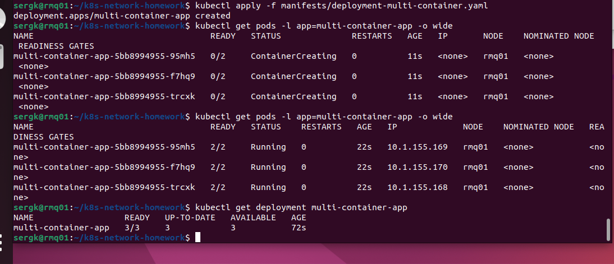
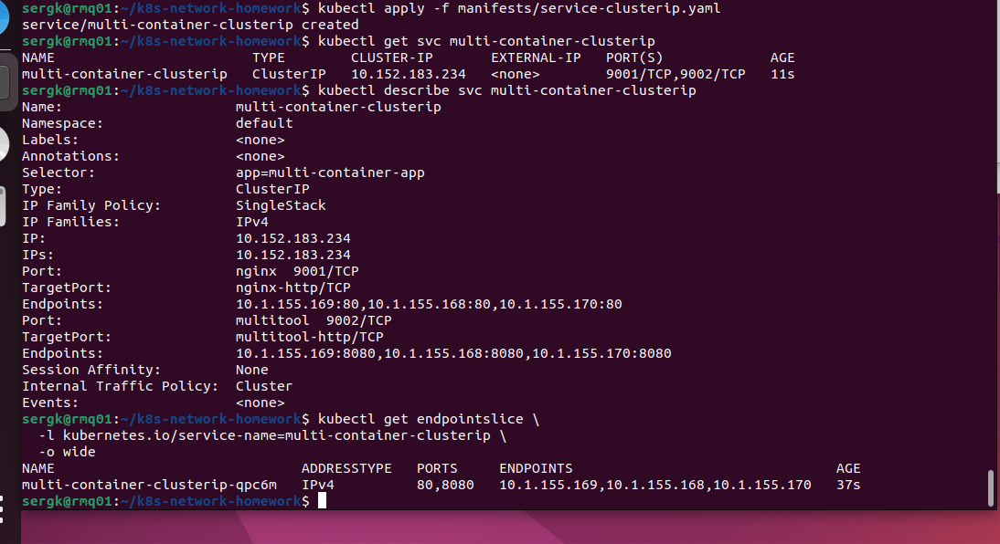
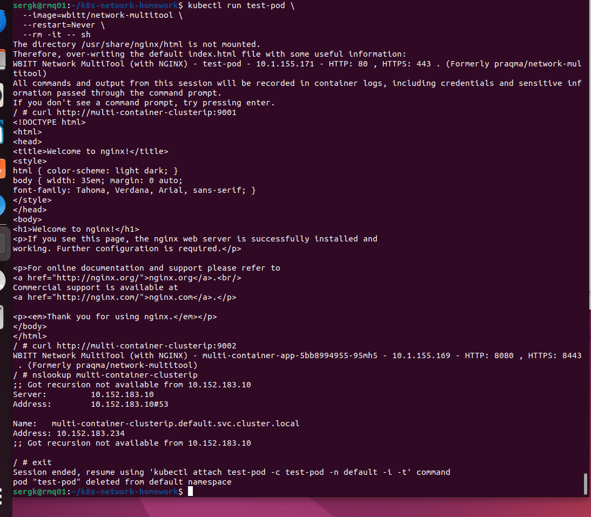
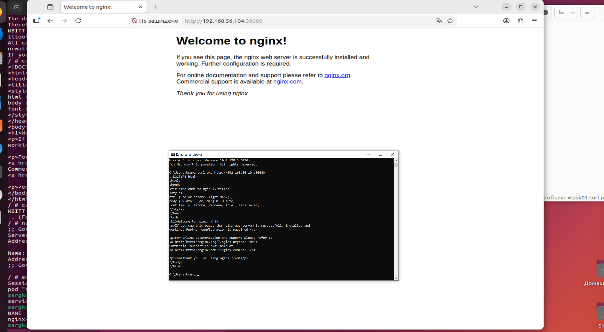
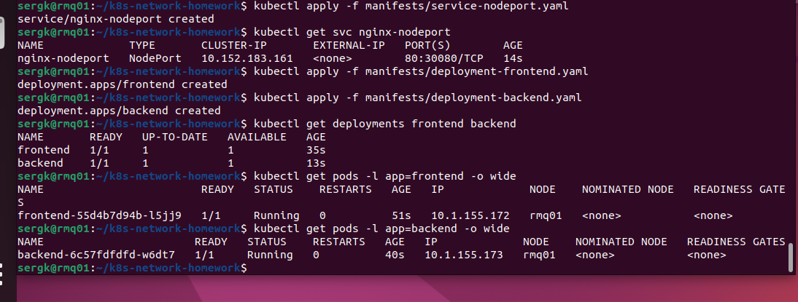
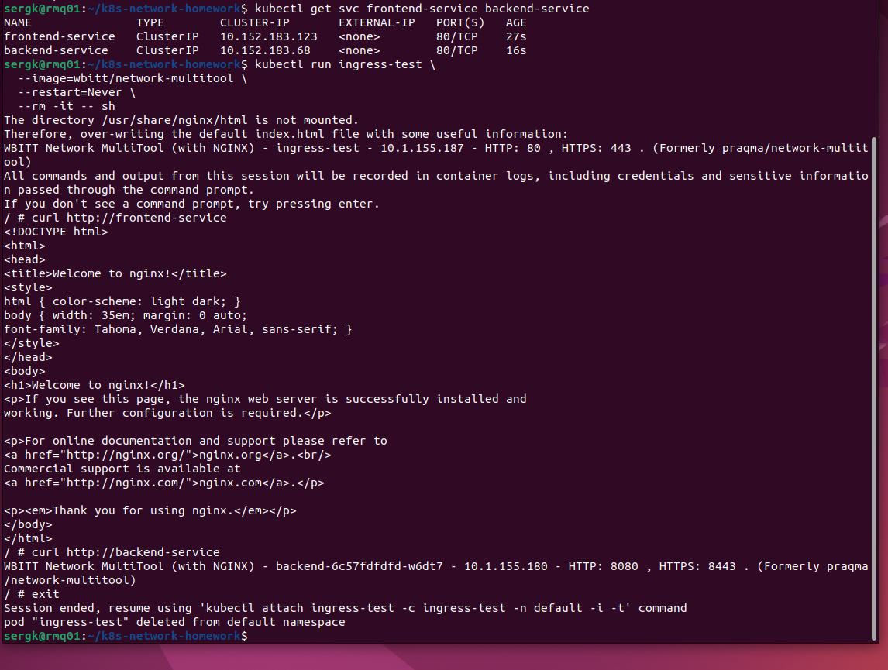
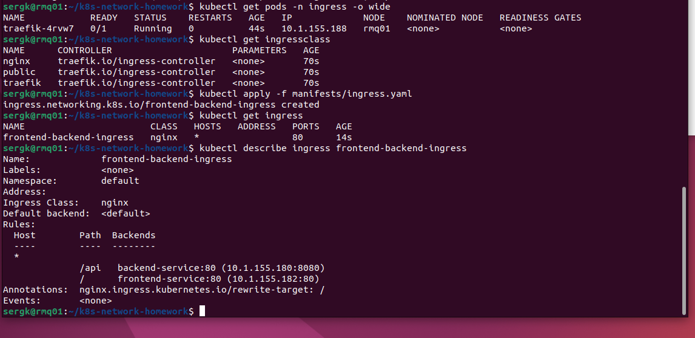
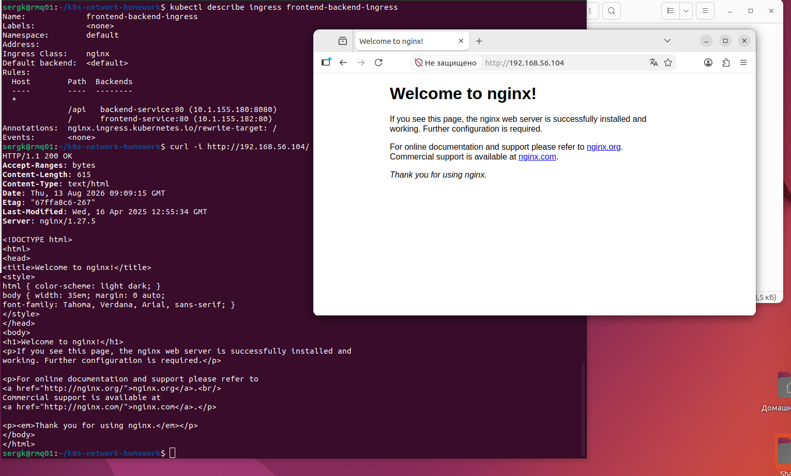
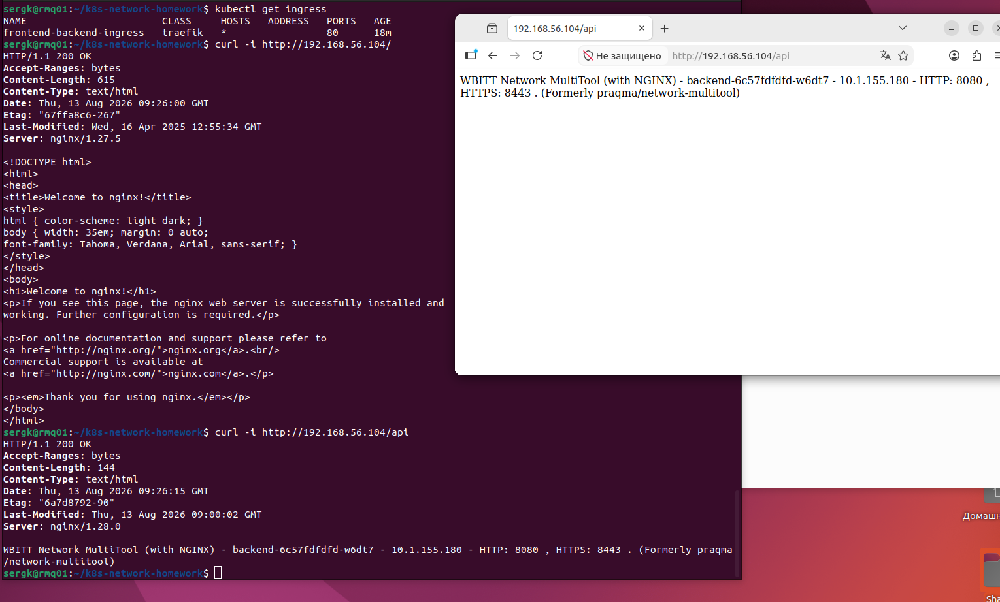
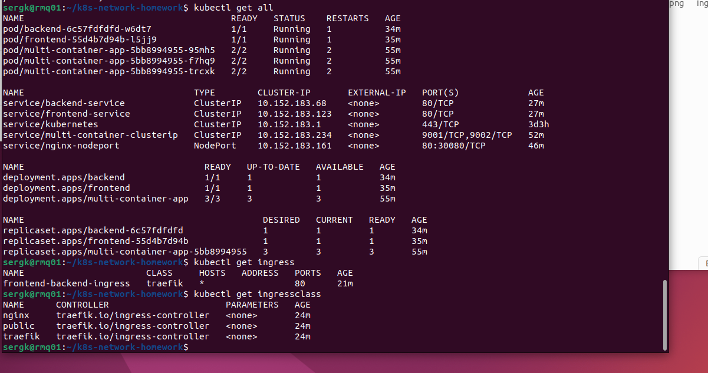

# Домашнее задание к занятию «Сетевое взаимодействие в Kubernetes»

## Исходное окружение

Для выполнения задания используется одна виртуальная машина Ubuntu 22.04 (Jammy) с установленным MicroK8s.

Основная ВМ:

```text
rmq01
Host-only IP: 192.168.56.104/24
Интерфейс: enp0s8
```

Также на ВМ уже настроен отдельный `kubectl`, подключённый к MicroK8s.


---

# Задание 1. Настройка Service (ClusterIP и NodePort)

Задача  
Развернуть приложение из двух контейнеров (nginx и multitool) и обеспечить доступ к ним:  
- Внутри кластера через ClusterIP.
- Снаружи через NodePort.
- 
Шаги выполнения  
1. Создать Deployment с двумя контейнерами:
  - nginx (порт 80).
  - multitool (порт 8080).
  - Количество реплик: 3.
2. Создать Service типа ClusterIP, который:
  - Открывает nginx на порту 9001.
  - Открывает multitool на порту 9002.
3. Проверить доступность изнутри кластера:
  - kubectl run test-pod --image=wbitt/network-multitool --rm -it -- sh
  - curl <service-name>:9001 # Проверить nginx
  - curl <service-name>:9002 # Проверить multitool
4. Создать Service типа NodePort для доступа к nginx снаружи.
5. Проверить доступ с локального компьютера:
  - curl <node-ip>:<node-port> или через браузер.

Что сдать на проверку  
Манифесты:  
- deployment-multi-container.yaml
- service-clusterip.yaml
- service-nodeport.yaml
Скриншоты проверки доступа (curl или браузер).  
 
## Решение 1

## 1.1. Deployment с nginx и multitool

Требуется создать Deployment из **трёх Pod**. В каждом Pod работают два контейнера:

- `nginx` — HTTP на порту `80`;
- `multitool` — HTTP на порту `8080`.

Манифест:

[`manifests/deployment-multi-container.yaml`](manifests/deployment-multi-container.yaml)

Применяем:

```bash
kubectl apply -f manifests/deployment-multi-container.yaml
```

Проверяем Deployment:

```bash
kubectl get deployment multi-container-app
```

Проверяем Pod:

```bash
kubectl get pods -l app=multi-container-app -o wide
```

Ожидаемый результат — три Pod в состоянии `Running`, например:

`READY 2/2` означает, что внутри каждого Pod успешно работают **два контейнера**.

### Скриншот 



---

## 1.2. Service типа ClusterIP

ClusterIP предоставляет приложению стабильный виртуальный IP и DNS-имя **внутри Kubernetes-кластера**.

Создаём Service с двумя портами:

| Service port | targetPort | Назначение |
|---:|---:|---|
| 9001 | 80 | nginx |
| 9002 | 8080 | multitool |

Манифест:

[`manifests/service-clusterip.yaml`](manifests/service-clusterip.yaml)

Применяем:

```bash
kubectl apply -f manifests/service-clusterip.yaml
```

Проверяем:

```bash
kubectl get svc multi-container-clusterip
```

Дополнительно:

```bash
kubectl describe svc multi-container-clusterip
```

Проверить, что Service нашёл Pod'ы Deployment, можно через EndpointSlice:

```bash
kubectl get endpointslice \
  -l kubernetes.io/service-name=multi-container-clusterip \
  -o wide
```


### Скриншот 



---

## 1.3. Проверка ClusterIP из отдельного Pod

ClusterIP предназначен для доступа **изнутри кластера**, поэтому запускаем временный Pod с multitool:

```bash
kubectl run test-pod \
  --image=wbitt/network-multitool \
  --restart=Never \
  --rm -it -- sh
```

После появления приглашения shell выполняем запрос к nginx:

```bash
curl http://multi-container-clusterip:9001
```

В ответе будет стандартная страница nginx с текстом:

```text
Welcome to nginx!
```

Теперь обращаемся к multitool:

```bash
curl http://multi-container-clusterip:9002
```

В ответе будет страница `Network MultiTool` с информацией о контейнере.

Для проверки DNS можно выполнить:

```bash
nslookup multi-container-clusterip
```


### Что доказывает эта проверка

Схема взаимодействия:

```text
test-pod
   |
   | DNS: multi-container-clusterip
   v
ClusterIP Service
   | 9001 -> targetPort 80
   | 9002 -> targetPort 8080
   |
   +------------------------------+
   |              |               |
   v              v               v
 Pod 1           Pod 2           Pod 3
 nginx:80        nginx:80        nginx:80
 multitool:8080  multitool:8080  multitool:8080
```

Service выбирает Pod'ы по метке:

```yaml
selector:
  app: multi-container-app
```

Для отчёта сделать скриншоты команд:

### Скриншот 



---

## 1.4. Service типа NodePort

ClusterIP недоступен непосредственно с локального компьютера. Для внешнего доступа создаём `NodePort`.

Манифест:

[`manifests/service-nodeport.yaml`](manifests/service-nodeport.yaml)

Применяем:

```bash
kubectl apply -f manifests/service-nodeport.yaml
```

Проверяем:

```bash
kubectl get svc nginx-nodeport
```

В ответе:

```text
NAME             TYPE       CLUSTER-IP       EXTERNAL-IP   PORT(S)
nginx-nodeport   NodePort   10.152.183.xxx   <none>        80:30080/TCP
```

Здесь:

```text
80       — порт самого Service
30080    — порт, открытый на Kubernetes Node
```

NodePort позволяет обращаться к приложению как:

```text
<NodeIP>:<NodePort>
```

Для ВМ:

```text
192.168.56.104:30080
```

---

## 1.5. Проверка NodePort с локального компьютера

На Windows-хосте выполнить PowerShell/CMD:

```powershell
curl.exe http://192.168.56.104:30080
```

Также можно открыть в браузере:

```text
http://192.168.56.104:30080
```


### Скриншот 



---

# Задание 2. Настройка Ingress

Задача  
Развернуть два приложения (frontend и backend) и обеспечить доступ к ним через Ingress по разным путям.

Шаги выполнения
1. Развернуть два Deployment:
  - frontend (образ nginx).
  - backend (образ wbitt/network-multitool).
2. Создать Service для каждого приложения.
3. Включить Ingress-контроллер:
  - microk8s enable ingress
4. Создать Ingress, который:
  - Открывает frontend по пути /.
  - Открывает backend по пути /api.
5. Проверить доступность:
  - curl <host>/
  - curl <host>/api
или через браузер.

Что сдать на проверку  
Манифесты:  
- deployment-frontend.yaml
- deployment-backend.yaml
- service-frontend.yaml
- service-backend.yaml
- ingress.yaml
- Скриншоты проверки доступа (curl или браузер).

## Решение 2

## 2.1. Deployment frontend

Frontend использует nginx.

Манифест:

[`manifests/deployment-frontend.yaml`](manifests/deployment-frontend.yaml)

Применяем:

```bash
kubectl apply -f manifests/deployment-frontend.yaml
```

---

## 2.2. Deployment backend

Backend использует `wbitt/network-multitool`.

Манифест:

[`manifests/deployment-backend.yaml`](manifests/deployment-backend.yaml)

Применяем:

```bash
kubectl apply -f manifests/deployment-backend.yaml
```

Проверяем оба Deployment:

```bash
kubectl get deployments frontend backend
```

Проверяем Pod:

```bash
kubectl get pods -l app=frontend -o wide
kubectl get pods -l app=backend -o wide
```

### Скриншот 



---

## 2.3. Создание Service для frontend и backend

Манифест frontend:

[`manifests/service-frontend.yaml`](manifests/service-frontend.yaml)

Манифест backend:

[`manifests/service-backend.yaml`](manifests/service-backend.yaml)

Создаём оба Service:

```bash
kubectl apply -f manifests/service-frontend.yaml
kubectl apply -f manifests/service-backend.yaml
```

Проверяем:

```bash
kubectl get svc frontend-service backend-service
```

Оба Service имеют тип `ClusterIP`, потому что напрямую наружу они не публикуются. Внешний трафик к ним будет направлять Ingress Controller.

Проверить их до создания Ingress можно временным Pod:

```bash
kubectl run ingress-test \
  --image=wbitt/network-multitool \
  --restart=Never \
  --rm -it -- sh
```

Внутри контейнера:

```bash
curl http://frontend-service
curl http://backend-service
```
### Скриншот 




---

## 2.4. Включение Ingress Controller в MicroK8s

Ingress-объект сам по себе не обрабатывает сетевой трафик. В кластере должен работать **Ingress Controller**.

В MicroK8s включаем штатный addon:

```bash
microk8s enable ingress
```

Проверяем состояние MicroK8s:

```bash
microk8s status
```

Далее проверяем Pod'ы namespace `ingress`:

```bash
kubectl get pods -n ingress -o wide
```

И смотрим доступные IngressClass:

```bash
kubectl get ingressclass
```

В подготовленном манифесте используется:

```yaml
ingressClassName: nginx
```

---

## 2.5. Создание Ingress

Манифест:

[`manifests/ingress.yaml`](manifests/ingress.yaml)

В нём настроено:

```text
/       -> frontend-service:80
/api    -> backend-service:80
```

Применяем:

```bash
kubectl apply -f manifests/ingress.yaml
```

Проверяем:

```bash
kubectl get ingress
```

Подробно:

```bash
kubectl describe ingress frontend-backend-ingress
```

### Скриншот 



---

## 2.6. Проверка frontend через Ingress

Так как ВМ имеет host-only IP:

```text
192.168.56.104
```

проверяем с самой ВМ:

```bash
curl -i http://192.168.56.104/
```

В ответе:

```text
HTTP/1.1 200 OK
```

и HTML стандартной страницы nginx:

```text
Welcome to nginx!
```


и в браузере:

```text
http://192.168.56.104/
```

### Скриншот 



---

## 2.7. Проверка backend через Ingress

Проверяем маршрут `/api`:

```bash
curl -i http://192.168.56.104/api
```

и в браузере:

```text
http://192.168.56.104/api
```

Запрос должен попасть не во frontend nginx, а в контейнер `network-multitool`.

Это доказывает, что Ingress выполняет маршрутизацию по URL path:

```text
/       -> frontend
/api    -> backend
```

### Скриншот 



---

# Полная проверка созданных объектов

Удобно выполнить:

```bash
kubectl get all
```

Но команда `get all` не выводит Ingress, поэтому дополнительно:

```bash
kubectl get ingress
kubectl get ingressclass
```

### Скриншот 



---

# Удаление ресурсов после выполнения задания

Удалить все созданные нами объекты:

```bash
kubectl delete -f manifests/
```

---

# Краткий вывод

В ходе работы были настроены три основных механизма доступа к приложениям Kubernetes:

- **ClusterIP** — внутренний доступ к приложению внутри Kubernetes-кластера;
- **NodePort** — внешний доступ через IP Kubernetes Node и выделенный TCP-порт;
- **Ingress** — HTTP-маршрутизация внешнего трафика к разным Service по URL.

Получившаяся схема:

```text
                  Kubernetes cluster

                        ClusterIP
 test Pod ---------------------> nginx / multitool

 Windows PC
     |
     | 192.168.56.104:30080
     v
 NodePort ---------------------> nginx

 Windows PC
     |
     | 192.168.56.104:80
     v
 Ingress
     |
     +--- / -------------------> frontend-service -> nginx
     |
     +--- /api ---------------> backend-service  -> multitool
```
